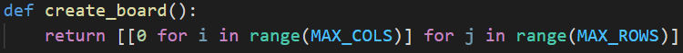
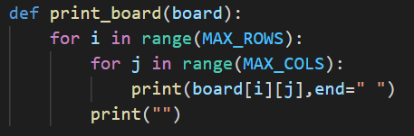
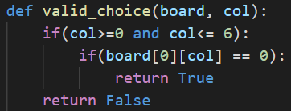
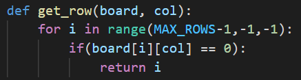
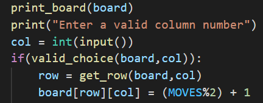
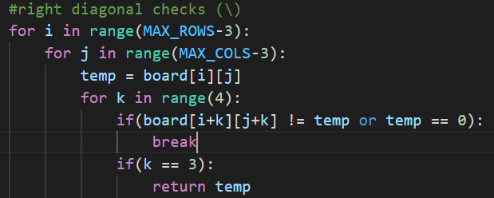
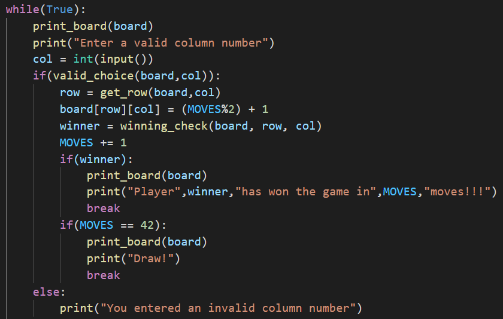

## Implementation

The first stage of our project was to make a simple CLI version of 2 player connect 4.

The first step to do so is make a game board. We have used an integer array with 6 rows and 7 columns as the game board. The number 0 represents an empty cell, 1 represents tokens of the first player and 2 represents tokens of the second player.

We also define a print\_board() function here to display the board to the user in the command line terminal. The function iterates through the board and prints the value in each cell.

The next task is to take input from the user and insert their piece in the game board. We do so in the following way:

1. Check if the column entered by the user has any empty cells. We define the valid\_choice() function which checks if the topmost cell of the entered column number is empty or not. It does not need to check other cells since pieces fall to the bottom in the vertical Connect 4 board.
If the entered column is full, a message is printed on the screen.

2. If the entered column is valid, then we get the lowest empty cell in that column using the get\_row() function. It iterates through the cells to find the required cell.

3. Change the value of the cell to the user&#39;s value. The row and column numbers of the cell are known to us. To find the users value, we define a variable called MOVES, which tracks the number of moves made in the game. When it is odd, it is the second player&#39;s move, and when it is even, it is the first player&#39;s move. It also helps us to determine if the game ends in a draw as we will see later. MOVES is incremented after each move.

Finally, we must determine when the game ends and print an appropriate message. The game ends when one of the players win, or if the board becomes full, in which case it is a draw.

To determine if a player has won the game, we define a function winning\_check() to iterate through the board and check each row, column and diagonal for 4 in a row. It returns 0 if neither player has won, otherwise it returns the winning player&#39;s number.

Following is a section from the winning\_check() function:

To know if the game ended in a draw, we check the MOVES variable. There are 7 x 6 = 42 cells in the board. When the MOVES variable becomes 42, the board is full, and the game ends in a draw provided that neither player has won.

We finally get the following code:

