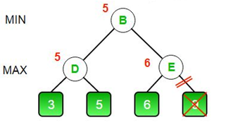
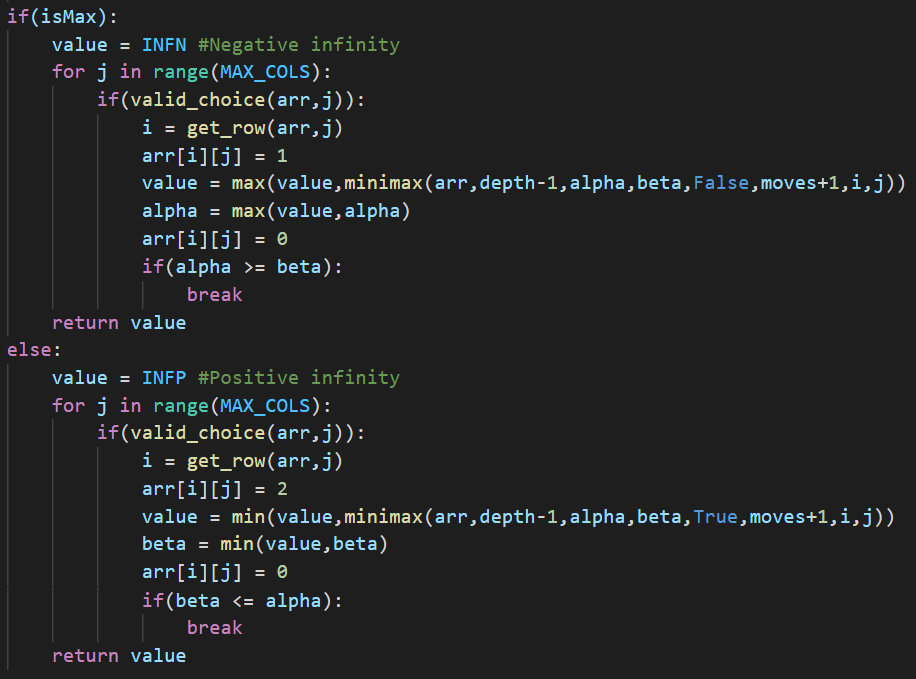
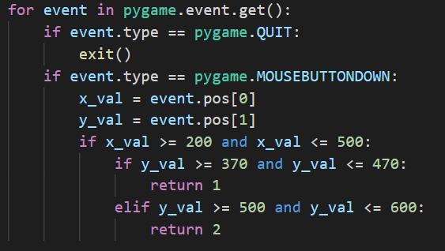
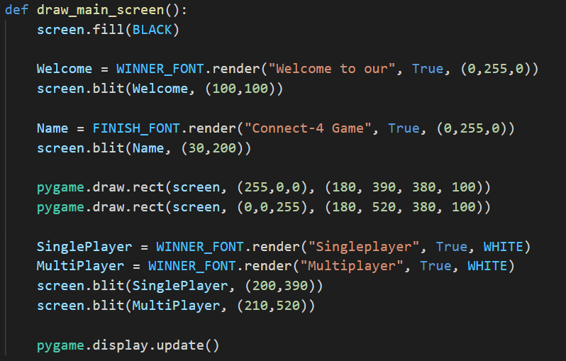
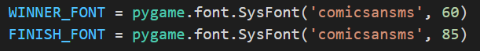
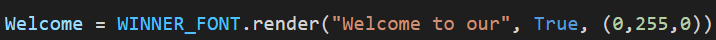
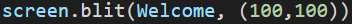
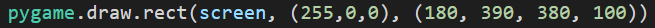
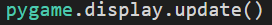
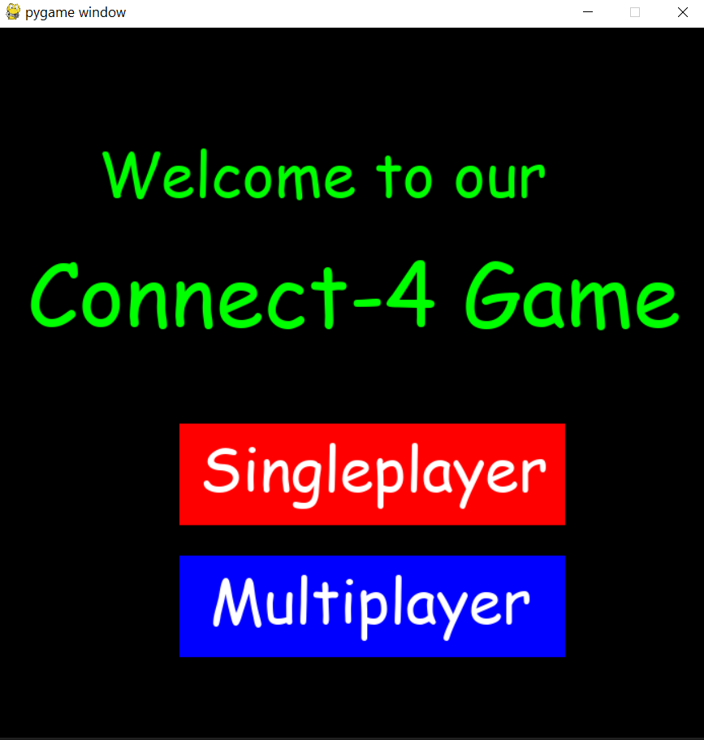

## Alpha-Beta Pruning

The minimax algorithm searches all the nodes of the game tree up to a
specific depth to find the best moves. The algorithm can be optimized to
“prune” or exclude those branches of the game tree which are guaranteed
to give worse moves.

### Core idea:

  

Consider the above game tree. First, node D is evaluated and it is
assigned the value of max(3,5) = 5. Now the algorithm begins evaluating
node E. It evaluates the left branch and gets a value of 6. Since E is a
maximizing node, its value will be greater than or equal to 6. However,
node B is a minimizing node and its value will be the minimum of the
values of nodes D and E. Since the value of node D is known to be 5, and
E is at least 6, the value of the node B will be 5. Now the algorithm
can prune or ignore the right branch of E, since it cannot influence the
value of the node B. This is the core idea of the alpha beta pruning
strategy.

### Implementation:

To implement alpha beta pruning, we track the minimum score possible of
the maximizing player in the alpha variable, and the maximum score
possible of the minimizing player in the beta variable. If beta becomes
less than or equal to alpha, we stop evaluating the descendants of the
node.

Let us consider the previous example again. After evaluating node D, the
minimizing player, at node B, is assured that the maximum possible score
is 5. Any larger value is not possible since the minimizing player takes
the minimum of possible scores. Hence, beta is 5.

At node E, upon evaluation of the left branch, the maximizing player is
assured of a score of 6. Any smaller value is not possible since the
maximizing player takes the maximum of possible scores. Hence, alpha
becomes 6.

Since beta becomes less than alpha, we stop evaluating descendants of
the node E.

In this manner, alpha beta pruning reduces the number of nodes
evaluated, significantly improving the speed of minimax algorithm.

It has been implemented in the project in following manner:

  

---

## Pygame

Pygame is a free and open-source python library commonly used for making
games. We have used pygame in our project to make the user interface.

### Handling inputs:

The pygame.event module is used in the project to handle inputs from the
user. The module stores all events such as mouse motion, mouse click,
etc. in a queue. When pygame.event.get() is called, a list of events is
returned and the event queue is reset. This list can be iterated and
each event can be individually handled.

Each event has attributes associated with it such as event.pos,
event.type, etc. which are used to discern the position of event, the
type of event, etc.

An example of its use in the project is as follows:

In the above code, the list of events is iterated. For each event, we
check the type of the event. Pygame.QUIT represents the action of
pressing the close button and pygame.MOUSEBUTTONDOWN represents the
action of clicking a mouse button. If the user clicks on the close
button, the game terminates. If the user clicks somewhere else, we
determine the position of the mouse click. The pos attribute of an event
is a tuple containing the x and y coordinates of the event. If the mouse
click lies in a particular region, the function returns a value.

### GUI:

To draw the GUI and change it when required, we need a way to handle
images. Pygame offers a way to do so in the pygame.Surface type object.
Pygame.Surface contains useful attribute functions such as blit(), which
is used to draw one surface over another.

We also need functions to manipulate these surfaces. For that purpose,
draw and display modules in pygame are used.

The pygame.draw module contains functions to draw various shapes on a
surface, and the pygame.display module lets us display a surface or
multiple surfaces to the user.

Finally, we need a way to represent text in the game. The pygame.font
module is used for rendering text on the screen. It uses
pygame.font.Font type objects to store information about the style of
text. This object also contains the render() attribute function to
create a new surface with text written on it.

Let us take a look at an example where these are used in the project:

Here, screen is the surface that is displayed to the user. WINNER\_FONT
and FINISH\_FONT are font type objects defined as follows:

Pygame.font.SysFont() is used to create a font type object. The two
arguments represent the font style and size respectively.

First, screen.fill(BLACK) is called. This fills the display surface with
the black colour.

Welcome and Name are surface type objects created using the render()
function.

The above line creates a surface that says “Welcome to our” in the text
style represented by WINNER\_FONT object. The colour of this text is
(0,255,0) in RGB, i.e., green. The second argument is antialiasing,
which is set to True to make the text appear smooth.

  

The blit() function draws the Welcome surface over the screen surface at
the specified position. This position is the position on the screen
surface where the top left corner of the welcome surface will be placed.

The coordinates used are in pixels with origin at the top left corner of
the screen surface. A coordinate of (x, y) is located x pixels to the
right and y pixels down from the top left corner.

Here, pygame.draw.rect() is used to draw a rectangle on the screen
surface. (255,0,0) represents the colour of the rectangle in RGB, i.e.,
red. The next argument is a tuple which contains information about the
position and size of the rectangle. The first two numbers, 180 and 390,
are the x and y coordinates of the top left corner of the rectangle. The
next two numbers, 380 and 100, are the width and height of the rectangle
in pixels respectively.

All the changes made so far to the screen surface only affect the
object, and are not displayed to the user. To update the screen seen by
the user, we have to call the pygame.display.update() function.

The code given above finally generates the following screen:

